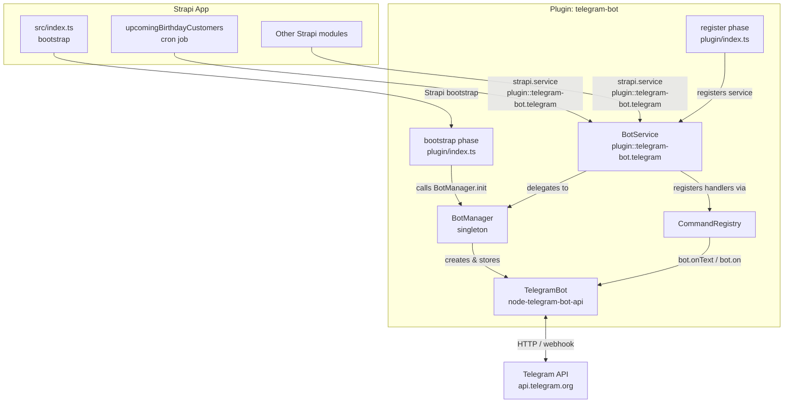
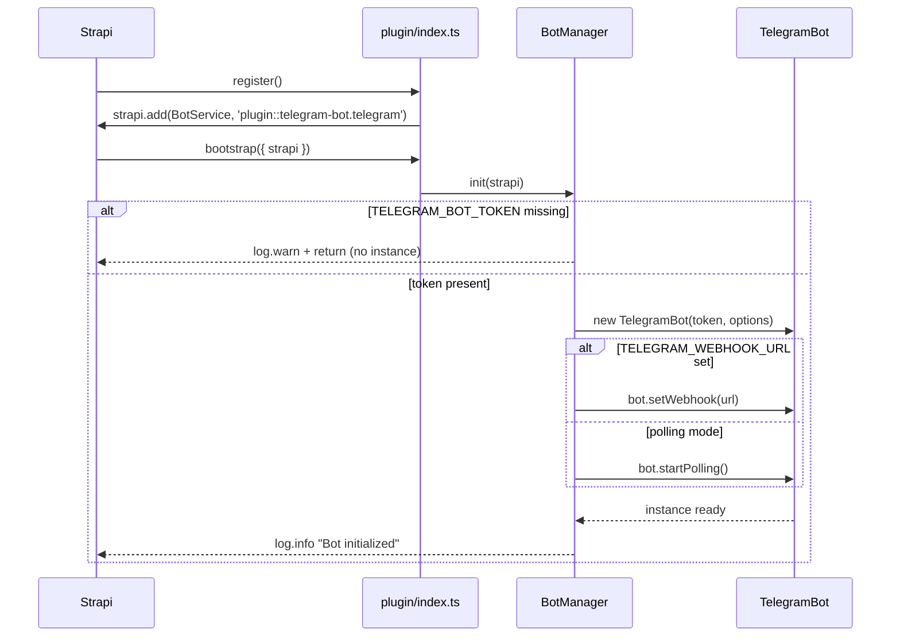
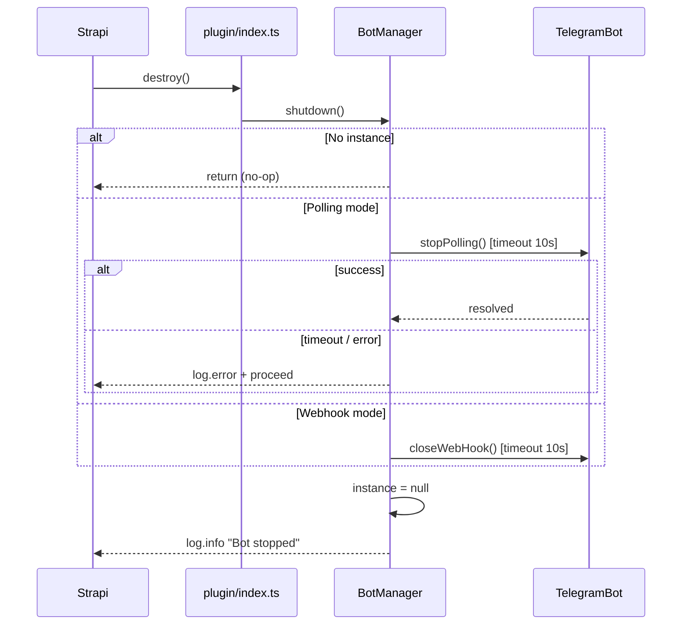
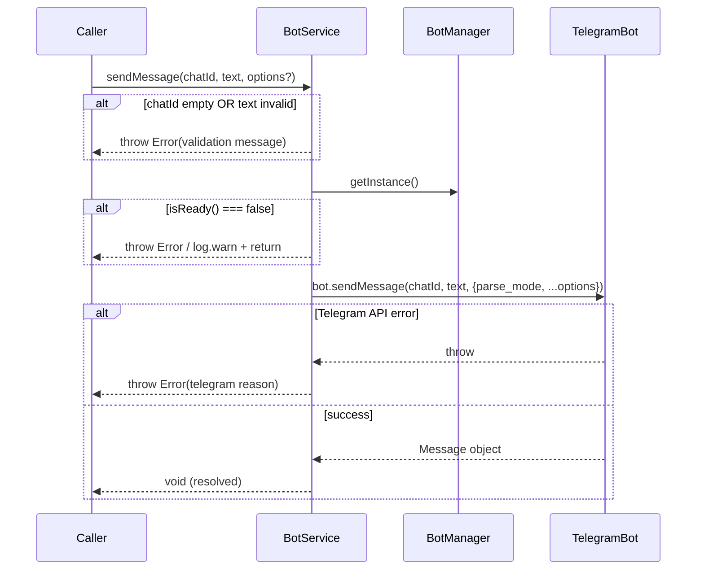

# Design Document — telegram-bot-plugin

## Overview

Plugin Strapi v5 local đặt tại `src/plugins/telegram-bot/` đóng gói toàn bộ logic tích hợp Telegram Bot vào một Strapi service có thể tái sử dụng. Plugin sử dụng thư viện `node-telegram-bot-api` và tuân thủ local plugin pattern của Strapi v5.

**Mục tiêu cốt lõi:**

- Singleton `BotManager` quản lý vòng đời TelegramBot instance (init, store, shutdown).
- `BotService` expose public API đồng nhất cho toàn ứng dụng: `sendMessage`, `sendDocument`, `sendPhoto`, `onCommand`, `onMessage`, `onCallbackQuery`, `isReady`, `getBotInfo`.
- `CommandRegistry` đăng ký handler lên TelegramBot instance.
- Graceful shutdown tích hợp với Strapi lifecycle event `destroy`.
- Hỗ trợ cả Polling (dev) và Webhook (production) mode qua biến môi trường.
- Cron job sinh nhật được refactor để dùng `BotService` thay vì raw `fetch()`.

**Không nằm trong scope:**

- Admin UI panel cho plugin.
- Inline bot mode (inline queries).
- Lưu trữ message history vào database.

---

## Architecture

### High-Level Component Diagram



### Bootstrap Sequence



### Graceful Shutdown Sequence



### sendMessage Flow



---

## Components and Interfaces

### Directory Structure

```
src/plugins/telegram-bot/
├── server/
│   ├── index.ts               # Plugin entry: register + bootstrap + destroy
│   ├── services/
│   │   └── telegram.ts        # BotService implementation
│   ├── bot/
│   │   ├── BotManager.ts      # Singleton quản lý TelegramBot lifecycle
│   │   └── CommandRegistry.ts # Đăng ký command/message/callback handlers
│   └── types.ts               # TypeScript public types
├── strapi-server.ts           # Re-export server entry (Strapi local plugin convention)
└── package.json               # (optional, for local plugin resolution)
```

### Plugin Entry Point (`server/index.ts`)

```typescript
import type { Core } from "@strapi/strapi";
import { createBotService } from "./services/telegram";
import { BotManager } from "./bot/BotManager";

export default {
  register({ strapi }: { strapi: Core.Strapi }) {
    strapi.add("plugin::telegram-bot.telegram", () => createBotService(strapi));
  },

  async bootstrap({ strapi }: { strapi: Core.Strapi }) {
    await BotManager.getInstance().init(strapi);
  },

  async destroy({ strapi }: { strapi: Core.Strapi }) {
    await BotManager.getInstance().shutdown(strapi);
  },
};
```

### BotService Interface (`server/services/telegram.ts`)

```typescript
export interface IBotService {
  /** Gửi tin nhắn văn bản */
  sendMessage(
    chatId: string,
    text: string,
    options?: SendMessageOptions,
  ): Promise<void>;

  /** Gửi file đính kèm */
  sendDocument(
    chatId: string,
    document: Buffer | string,
    options?: SendDocumentOptions,
  ): Promise<void>;

  /** Gửi ảnh */
  sendPhoto(
    chatId: string,
    photo: Buffer | string,
    options?: SendPhotoOptions,
  ): Promise<void>;

  /** Đăng ký command handler (e.g. "help" hoặc "/help") */
  onCommand(command: string, handler: CommandHandler): void;

  /** Đăng ký listener cho tất cả tin nhắn */
  onMessage(handler: MessageHandler): void;

  /** Đăng ký listener cho inline keyboard callback */
  onCallbackQuery(handler: CallbackQueryHandler): void;

  /** Kiểm tra bot đã sẵn sàng chưa */
  isReady(): boolean;

  /** Lấy thông tin bot từ Telegram API */
  getBotInfo(): Promise<BotInfoResult>;
}
```

### BotManager Interface (`server/bot/BotManager.ts`)

```typescript
export class BotManager {
  private static instance: BotManager;
  private bot: TelegramBot | null = null;
  private mode: "polling" | "webhook" | null = null;

  static getInstance(): BotManager;
  async init(strapi: Core.Strapi): Promise<void>;
  async shutdown(strapi: Core.Strapi): Promise<void>;
  getBot(): TelegramBot | null;
  isInitialized(): boolean;
}
```

**Luồng `init()`:**

1. Đọc `TELEGRAM_BOT_TOKEN` từ `process.env`; nếu rỗng/whitespace → `strapi.log.warn` + return sớm.
2. Kiểm tra `this.bot !== null` (idempotency guard) → return nếu đã init.
3. Xác định mode: `TELEGRAM_WEBHOOK_URL` có giá trị → webhook, ngược lại → polling.
4. Khởi tạo `new TelegramBot(token, { polling: mode === 'polling', webHook: mode === 'webhook' ? { port } : undefined })`.
5. Nếu webhook: gọi `bot.setWebhook(url)`.
6. Bọc trong `try/catch`: lỗi → `strapi.log.error` + `this.bot = null`.
7. Log `info` khi thành công.

**Luồng `shutdown()`:**

1. Nếu `this.bot === null` → return (no-op, không throw).
2. Race `Promise` giữa stop/close call và `setTimeout(10_000)`.
3. Log lỗi nếu timeout hoặc exception; luôn set `this.bot = null` ở `finally`.
4. Log `info` khi hoàn tất.

### CommandRegistry (`server/bot/CommandRegistry.ts`)

```typescript
export class CommandRegistry {
  /**
   * Chuẩn hoá command string thành RegExp.
   * "help" hoặc "/help" → /^\/help(@\w+)?(\s|$)/i
   */
  static normalizeCommand(command: string): RegExp;

  /**
   * Đăng ký command handler lên TelegramBot instance.
   */
  static register(
    bot: TelegramBot,
    command: string,
    handler: CommandHandler,
  ): void;

  /**
   * Đăng ký message listener.
   */
  static registerMessageHandler(
    bot: TelegramBot,
    handler: MessageHandler,
  ): void;

  /**
   * Đăng ký callback_query listener.
   */
  static registerCallbackQueryHandler(
    bot: TelegramBot,
    handler: CallbackQueryHandler,
  ): void;
}
```

---

## Data Models

### TypeScript Types (`server/types.ts`)

```typescript
import type TelegramBot from "node-telegram-bot-api";

// ── Send option types ──────────────────────────────────────────────────────────

export interface SendMessageOptions {
  parse_mode?: "HTML" | "MarkdownV2";
  reply_markup?:
    | TelegramBot.InlineKeyboardMarkup
    | TelegramBot.ReplyKeyboardMarkup;
  disable_web_page_preview?: boolean;
  disable_notification?: boolean;
  reply_to_message_id?: number;
}

export interface SendDocumentOptions {
  filename?: string;
  caption?: string;
  parse_mode?: "HTML" | "MarkdownV2";
  disable_notification?: boolean;
}

export interface SendPhotoOptions {
  caption?: string;
  parse_mode?: "HTML" | "MarkdownV2";
  disable_notification?: boolean;
}

// ── Handler types ──────────────────────────────────────────────────────────────

/** Handler cho bot command (e.g. /help) */
export type CommandHandler = (
  message: TelegramBot.Message,
  match: RegExpExecArray | null,
) => void | Promise<void>;

/** Handler cho tất cả tin nhắn thông thường */
export type MessageHandler = (
  message: TelegramBot.Message,
) => void | Promise<void>;

/** Handler cho inline keyboard callback_query */
export type CallbackQueryHandler = (
  callbackQuery: TelegramBot.CallbackQuery,
) => void | Promise<void>;

// ── Result types ───────────────────────────────────────────────────────────────

export interface BotInfoResult {
  id: number;
  username: string;
  first_name: string;
}

// ── Validation constants ───────────────────────────────────────────────────────

export const MAX_MESSAGE_LENGTH = 4096; // Telegram text limit
export const MAX_DOCUMENT_SIZE = 50 * 1024 * 1024; // 50 MB
export const MAX_PHOTO_SIZE = 10 * 1024 * 1024; // 10 MB
export const DEFAULT_WEBHOOK_PORT = 8443;
```

### Environment Variables

| Variable                | Required      | Default             | Description               |
| ----------------------- | ------------- | ------------------- | ------------------------- |
| `TELEGRAM_BOT_TOKEN`    | Yes (runtime) | —                   | Bot token từ @BotFather   |
| `TELEGRAM_WEBHOOK_URL`  | No            | `""` (polling mode) | URL công khai cho webhook |
| `TELEGRAM_WEBHOOK_PORT` | No            | `8443`              | Port webhook server       |

### Validation Rules

| Method         | Field               | Rule             |
| -------------- | ------------------- | ---------------- |
| `sendMessage`  | `chatId`            | Non-empty string |
| `sendMessage`  | `text`              | Length 1–4096    |
| `sendDocument` | `document` (Buffer) | Size ≤ 50 MB     |
| `sendPhoto`    | `photo` (Buffer)    | Size ≤ 10 MB     |

---

## Cron Job Refactor

### Thay đổi trong `src/cron/upcomingBirthdayCustomers.ts`

**Trước (raw fetch):**

```typescript
// ❌ Trước: inline sendTelegram dùng fetch()
async function sendTelegram(botToken: string, chatId: string, text: string) {
  const url = `https://api.telegram.org/bot${botToken}/sendMessage`;
  const res = await fetch(url, { method: "POST", ... });
  if (!res.ok) throw new Error(`Telegram API error ${res.status}: ...`);
}

// Trong task:
const botToken = process.env.TELEGRAM_BOT_TOKEN;
if (!botToken) { strapi.log.warn(...); return; }
await sendTelegram(botToken, staff.telegramChatId, msg);
```

**Sau (BotService):**

```typescript
// ✅ Sau: resolve BotService, guard với isReady()
const botService = strapi.service("plugin::telegram-bot.telegram");

if (!botService.isReady()) {
  strapi.log.warn(
    "[BirthdayCron] TelegramBot chưa sẵn sàng, bỏ qua gửi tin nhắn.",
  );
  return;
}

// Gửi tin nhắn — parse_mode HTML là default, không cần truyền thêm
await botService.sendMessage(staff.telegramChatId, msg);
```

**Danh sách thay đổi cụ thể:**

1. Xóa toàn bộ hàm `sendTelegram()` và import `fetch` không cần thiết.
2. Xóa dòng đọc `process.env.TELEGRAM_BOT_TOKEN` trong task (không còn cần).
3. Thêm guard `botService.isReady()` trước vòng lặp gửi; nếu `false` → `log.warn` + `return`.
4. Thay `await sendTelegram(botToken, staff.telegramChatId, msg)` bằng `await botService.sendMessage(staff.telegramChatId, msg)`.
5. Giữ nguyên: phân loại birthday, group theo staff, skip `__no_staff__`, skip staff không có `telegramChatId`, format HTML, log `sentCount`/`skipCount`.

---

## Cập nhật `config/plugins.ts`

```typescript
// Thêm vào object config:
"telegram-bot": {
  enabled: true,
  resolve: "./src/plugins/telegram-bot",
},
```

Strapi v5 local plugin yêu cầu `resolve` trỏ đến thư mục chứa `strapi-server.ts` (hoặc `strapi-server.js`).

---

## Error Handling

### Validation Errors (thrown trước khi gọi API)

| Condition           | Error Message                                      |
| ------------------- | -------------------------------------------------- |
| `chatId` rỗng       | `"chatId must be a non-empty string"`              |
| `text` rỗng         | `"text must be a non-empty string"`                |
| `text` > 4096 chars | `"text exceeds maximum length of 4096 characters"` |
| Buffer > 50 MB      | `"document size exceeds maximum of 50 MB"`         |
| Buffer > 10 MB      | `"photo size exceeds maximum of 10 MB"`            |

### Runtime Errors (từ Telegram API)

Tất cả lỗi từ `node-telegram-bot-api` được wrap và re-throw:

```typescript
catch (err: unknown) {
  const reason = err instanceof Error ? err.message : String(err);
  throw new Error(`Telegram API error: ${reason}`);
}
```

### Not-Ready Guard

```typescript
// Áp dụng cho sendMessage, sendDocument, sendPhoto
if (!BotManager.getInstance().isInitialized()) {
  // Requirement 8.2: log warn + return void (không throw)
  strapi.log.warn("[BotService] Bot is not ready, skipping send operation");
  return;
}
```

> **Lưu ý phân biệt:** `isReady() === false` → phương thức gửi **không throw**, chỉ log warn và return. Nhưng `getBotInfo()` với `isReady() === false` → **throw** `Error("TelegramBot is not initialized")`. Cron job dùng `isReady()` guard nên sẽ không bị throw.

### Shutdown Timeout Pattern

```typescript
async function withTimeout<T>(promise: Promise<T>, ms: number): Promise<T> {
  return Promise.race([
    promise,
    new Promise<never>((_, reject) =>
      setTimeout(() => reject(new Error(`Timeout after ${ms}ms`)), ms),
    ),
  ]);
}

// Trong shutdown():
try {
  if (this.mode === "polling") {
    await withTimeout(this.bot.stopPolling(), 10_000);
  } else {
    await withTimeout(this.bot.closeWebHook(), 10_000);
  }
  strapi.log.info("[BotManager] TelegramBot stopped successfully");
} catch (err) {
  strapi.log.error(`[BotManager] Shutdown error: ${err}`);
} finally {
  this.bot = null;
  this.mode = null;
}
```

---

## Testing Strategy

### Unit Tests

Mỗi component có file test riêng:

- **`BotManager.test.ts`** — test `init()` và `shutdown()` với mock TelegramBot:

  - Token missing → warn + no instance
  - Token present, polling mode → `startPolling()` called
  - Token present, webhook mode → `setWebhook(url)` called
  - Idempotency: gọi `init()` hai lần → chỉ một instance
  - Shutdown: `stopPolling()` / `closeWebHook()` called; instance reset về null
  - Shutdown timeout: log error, instance vẫn được reset

- **`BotService.test.ts`** — test validation và delegation:

  - `sendMessage` với input hợp lệ → delegate xuống bot
  - `sendMessage` với chatId rỗng → throw validation error
  - `sendMessage` với text > 4096 → throw validation error
  - `sendDocument` Buffer > 50 MB → throw
  - `sendPhoto` Buffer > 10 MB → throw
  - `isReady() === false` → các phương thức gửi return void, không throw
  - `getBotInfo()` khi not ready → throw `"TelegramBot is not initialized"`

- **`CommandRegistry.test.ts`** — test regex normalization:
  - `"help"` → `/^\/help(@\w+)?(\s|$)/i`
  - `"/help"` → `/^\/help(@\w+)?(\s|$)/i`
  - Uppercase command → case-insensitive match

### Property-Based Tests

Sử dụng thư viện **`fast-check`** (TypeScript-native, zero dependencies ngoài devDependencies). Mỗi property test chạy tối thiểu **100 iterations**.

```
npm install --save-dev fast-check
```

Tag comment format: `// Feature: telegram-bot-plugin, Property N: <property_text>`

_(Các properties cụ thể được liệt kê trong section Correctness Properties bên dưới)_

### Integration Tests

- Cần có `TELEGRAM_BOT_TOKEN` thực trong CI environment
- Test `getMe()` trả về đúng thông tin bot
- Test `sendMessage()` thực sự gửi đến test chat

---

## Correctness Properties

_A property is a characteristic or behavior that should hold true across all valid executions of a system — essentially, a formal statement about what the system should do. Properties serve as the bridge between human-readable specifications and machine-verifiable correctness guarantees._

### Property 1: Valid sendMessage inputs are forwarded to Telegram library

_For any_ non-empty `chatId` string and any `text` string with length between 1 and 4096 characters, calling `sendMessage(chatId, text)` shall result in the underlying `bot.sendMessage()` being called with those exact values (plus default `parse_mode: "HTML"` when not specified).

**Validates: Requirements 2.2, 2.4**

---

### Property 2: Send options are forwarded unchanged

_For any_ `parse_mode` value (`"HTML"` or `"MarkdownV2"`) and any valid `reply_markup` structure passed in `options`, calling `sendMessage(chatId, text, options)` shall result in the underlying `bot.sendMessage()` receiving those option fields exactly as provided, without modification.

**Validates: Requirements 2.3, 2.5**

---

### Property 3: Invalid sendMessage inputs throw validation errors before reaching Telegram

_For any_ `chatId` that is an empty string, OR any `text` that is an empty string, OR any `text` whose length exceeds 4096 characters, calling `sendMessage(chatId, text)` shall throw an `Error` identifying the invalid field, and `bot.sendMessage()` shall NOT be called.

**Validates: Requirements 2.6**

---

### Property 4: Valid Buffer inputs to sendDocument and sendPhoto are forwarded

_For any_ `Buffer` whose size is within the allowed limit (≤ 50 MB for `sendDocument`, ≤ 10 MB for `sendPhoto`), calling the respective send method shall result in the underlying library method being called with that exact Buffer, unmodified.

**Validates: Requirements 3.3, 3.4**

---

### Property 5: Oversized Buffer inputs throw size validation errors

_For any_ `Buffer` whose size exceeds the allowed limit (> 50 MB for `sendDocument`, > 10 MB for `sendPhoto`), calling the respective send method shall throw an `Error` identifying the size limit exceeded, and the underlying library method shall NOT be called.

**Validates: Requirements 3.6**

---

### Property 6: String media inputs are passed through to the library unchanged

_For any_ non-empty `string` value passed as the `document` or `photo` argument, calling `sendDocument` or `sendPhoto` shall result in the underlying library method receiving that exact string value (representing a Telegram file_id or URL), without any transformation.

**Validates: Requirements 3.5**

---

### Property 7: Command string normalization is consistent and idempotent

_For any_ command string (with or without a leading `/`, in any case combination), `CommandRegistry.normalizeCommand()` shall produce a `RegExp` that:

1. Matches a message text starting with `/<command>` (case-insensitive).
2. Produces the same `RegExp` whether the input has a leading slash or not (normalization is idempotent).

**Validates: Requirements 4.2**

---

_Note: Requirements 1.x (bootstrap lifecycle), 5.x (shutdown sequences), 6.x (cron integration), 7.x (env config), and 8.x (isReady guard/getBotInfo) are best covered by example-based unit tests and integration tests — see Testing Strategy above. PBT adds the most value for the input-validation, option-forwarding, and regex-normalization logic described in Properties 1–7 above._
